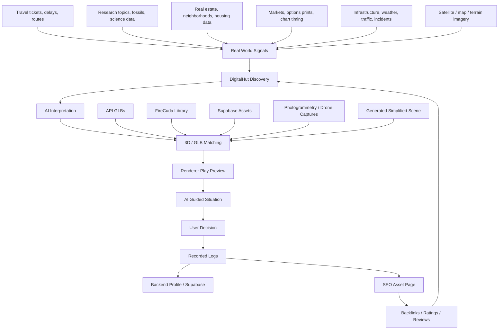

# DigitalHut Real World 3D Intelligence Map

DigitalHut should not describe 3D rendering with one number. The value is not only polygon count, realism, or file size. The value is whether the 3D object helps a person understand and complete a real-world situation.

## Core Idea

DigitalHut connects:

```text
real-world signal
-> AI interpretation
-> closest 3D visual
-> guided decision
-> recorded logs
-> SEO/public knowledge asset
```

The closest familiar system is satellite imagery, but DigitalHut is not limited to overhead maps. It can use GLB environments, scanned structures, 3D models, AI narration, market data, travel hints, research notes, and situation logs.

## Global Location Rendering Stack

DigitalHut should attempt location rendering in this order:

1. Google Photorealistic 3D Tiles for populated real-world 3D mesh coverage.
2. Cesium ion / CesiumJS for globe, terrain, buildings, 3D Tiles, and owner-uploaded data.
3. OpenStreetMap / Overture for roads, buildings, places, and structural context.
4. DigitalHut FireCuda/Supabase GLB library for owner-created environments.
5. Field capture mission when no good public 3D source exists.
6. Simplified generated scene only if clearly labeled as a placeholder.

This creates a "map any location" system without pretending every place already has perfect 3D coverage.

## Owner Capture Effort

The first owner capture lane should focus on real-world exotic environments near Anthony's location:

- Santiago Dominican Republic streets and neighborhoods
- small villages
- docks and river/coastal access
- markets and food areas
- farms and cattle areas
- mountain/terrain regions
- jungle trails and crossings
- local buildings and research-center candidates

Capture path:

```text
camera / phone / drone / 360 photos
-> organized source folder
-> photogrammetry or scan processing
-> optimized GLB
-> Supabase / FireCuda storage
-> DigitalHut location page
-> AI guided presentation
-> SEO asset page
```

## Why This Matters

A normal 3D website says:

```text
Here is a model.
```

DigitalHut should say:

```text
Here is the place, object, or system. Here is why it matters. Here is what you may need to do next.
```

Examples:

- A student sees a 3D biology model and the AI guides research notes.
- A traveler sees a New York airport/route model and the AI notices wrong ticket or timing information.
- A researcher sees a fossil/lab/terrain model and the AI asks what detail they need verified.
- A real estate viewer sees a neighborhood model and the AI connects it to housing data.
- A developer sees a backend/rendering model and the AI explains what code or asset pipeline is failing.
- A market viewer sees a ticker print and the AI explains amount, timing, and chart context without pretending to know trader identity.

## Travel Hint Example

Situation:

```text
Flight ticket to New York has wrong ticket information.
```

DigitalHut should not reward this as a binary "correct/incorrect" event. It should guide:

```text
I noticed the ticket details may not match the intended destination or timing. Check airport code, date, passenger name, departure time, and connecting city before confirming. I can save this as a travel-risk note and show the New York route context.
```

Recorded log:

```text
category: travel
signal: ticket mismatch
model: New York / airport / route environment
ai_hint: verify airport code, date, name, route
user_action: saved note / corrected ticket / ignored
seo_use: travel planning mistake checklist with 3D airport context
```

## Research Hint Example

Situation:

```text
Student or researcher is viewing a complex scientific model.
```

DigitalHut should guide:

```text
This model is useful for structure, location, and scale. What are you trying to identify: material, age, damage, environment, or relation to another object?
```

Recorded log:

```text
category: researcher
signal: scientific model viewed
model: fossil / molecule / terrain / lab scene
ai_hint: ask what detail needs verification
user_action: note saved / source checked / related model opened
seo_use: research model guide page
```

## Realism Is Multi-Dimensional

3D model quality should include:

- visual realism
- scale usefulness
- source trust
- relation to real-world situation
- load speed
- WebGL reliability
- texture clarity
- metadata quality
- AI explanation quality
- user decision support
- share/backlink value
- review/rating value

DigitalHut should score these separately instead of compressing everything into one number.

## Grand System Map



## SEO Expansion

DigitalHut SEO should target situation-based keywords, not only "3D model viewer."

Keyword clusters:

- AI 3D observatory
- 3D model rendering guidance
- GLB research assistant
- 3D travel planning visualization
- 3D airport route visualization
- 3D real estate neighborhood viewer
- 3D infrastructure situation report
- satellite-style 3D environment system
- AI guided GLB presentation
- WebGL model viewer with AI narration
- 3D situation intelligence
- real-world 3D decision support

## Interface Direction

DigitalHut should add a future panel:

```text
Situation Intelligence
```

Fields:

- real-world signal
- matched 3D asset
- confidence
- AI hint
- recommended check
- saved note
- source links
- action taken
- SEO page status

## Operating Rule

DigitalHut should not only ask:

```text
Did the model render?
```

It should ask:

```text
Did the model help the person understand and complete something real?
```
